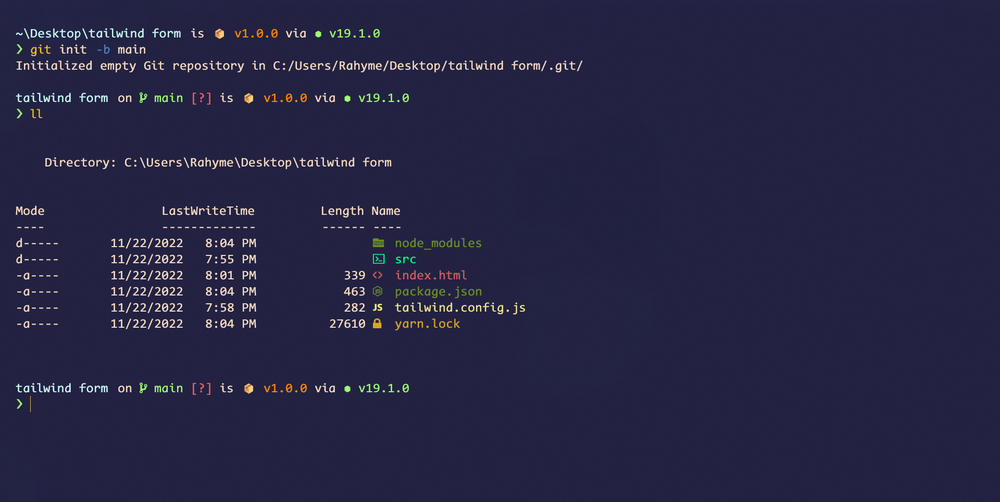

# Setup the terminal

_This setup is only for the powershell user_

- Install Nerd Font From [nerdfonts.com](https://www.nerdfonts.com/font-downloads).
- Run the following commands.

```sh
# install git
winget install -e --id Git.Git

# install starship for poweshell
winget install --id Starship.Starship

# install windows terminal icon (Nerdfont required)
Install-Module -Name Terminal-Icons -Repository PSGallery -Force
```

__To use Microsoft Powershell Profile run the following command in Adminstrator mode__

```sh
# Adminstrator mode required
Set-ExecutionPolicy Unrestricted
```

## Screenshot


